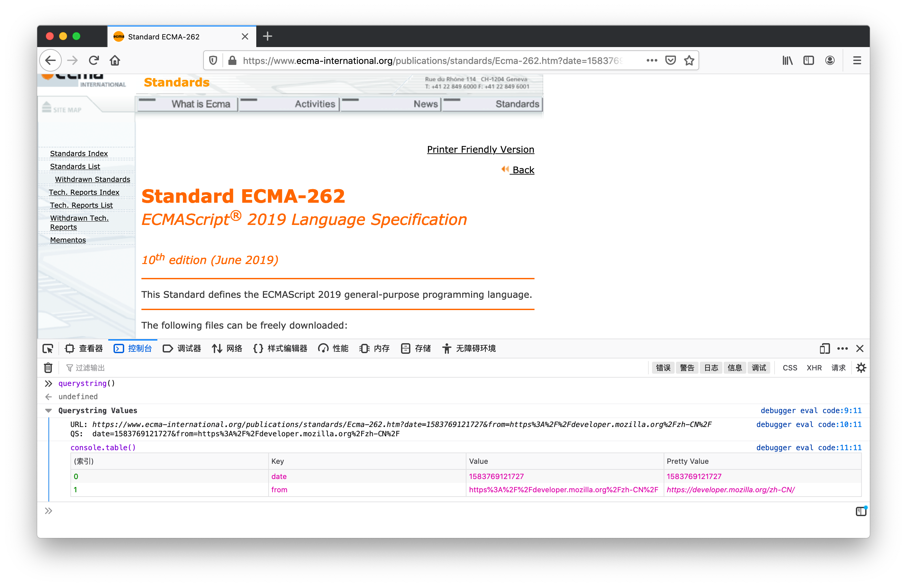

> 在业务开发中我们经常会遇到从页面的 URL 中获取查询字符串，常见场景类似 http://xxx.com/list?pagination=10，它后面的参数代表搜索列表页的第十页。

接下来我介绍处理 URL 中查询字符串的常用方法。

```js
(function() {

  var url = location;
  var querystring = location.search.slice(1);
  var tab = querystring.split("&").map(function(qs) {
    return {
      "Key": qs.split("=")[0],
      "Value": qs.split("=")[1],
      // 为了方便用户查看，我们需要将字符中的值进行decode
      "Pretty Value": decodeURIComponent(qs.split("=")[1]).replace(//g," ") }
  });

  console.group("Querystring Values");
  console.log("URL: "+url+"\nQS:  "+querystring);
  console.table(tab);
  console.groupEnd("Querystring Values");

})();
```

在处理常见链接"https://www.ecma-international.org/publications/standards/Ecma-262.htm?date=1583769121727&from=https%3A%2F%2Fdeveloper.mozilla.org%2Fzh-CN%2F"时

代码运行如下所示 :

