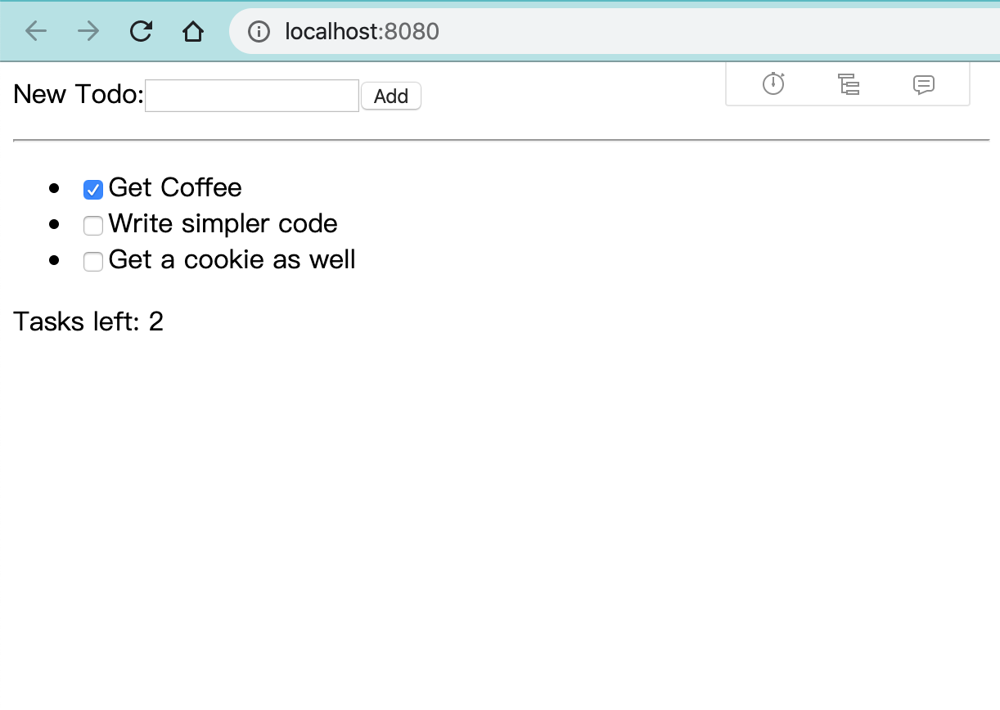

# 在 React App 中实现国际化（Mobx篇）

## 实现国际化

今天我来分享一下在 React App 中如何实现国际化，并把它封装成一个 Package 发布到 npm 平台。

在开发大型 React 应用时，我们为了让代码结构清晰、组件间高效通信，常常需要引入状态管理库。主要有 [Redux](https://redux.js.org/) [Mobx](https://mobx.js.org/) ，由于 Mobx 的简单易用、描述组件的状态颗粒度更小等特点，我更偏爱 Mobx。

### Step1: 搭建环境

为了省去搭建 React 和 Mobx 的环境，直接 clone 一份 Mobx 作者维护的样板代码 [mobx-react-boilerplate](https://github.com/mobxjs/mobx-react-boilerplate.git)

```shell
git clone https://github.com/mobxjs/mobx-react-boilerplate.git
```

安装 `npm install` 后启动 `npm start` 就可以看到一个非常精简的 Todo App（待办事项）



### Step2: 创建国际化资源文件和国际化状态管理文件

把页面中涉及到的国际化文本分别存储在中英文配置文件中，在`src/i18n` 目录下创建 `zh-CN.json` `en-US.json`

并把这些资源维护到全局状态中（方便组件渲染和切换语言）

```jsx
// src/models/IntlModel.js
import { observable, computed, action } from "mobx";
import enUS from '../i18n/en-US.json';
import zhCN from '../i18n/zh-CN.json';

export default class IntlModel {
    @observable language = 'zh-CN';
    @computed get resource() {
        switch (this.language) {
            case 'zh-CN':
                return zhCN;
            case 'en-US':
                return enUS;
            default:
                return zhCN;
        }
    }
    @action changeLanguageTo(language) {
        this.language = language;
    }
}
```

将 IntlModel 注入到 Provider 中

```jsx
// ...
import { Provider } from 'mobx-react';
import IntlModel from "./models/IntlModel";
// ...

const intlStore = new IntlModel();
render(
  <Provider intlStore={intlStore}>
    <div>
      <DevTools />
      <TodoList store={store} />
    </div>
  </Provider>,
  document.getElementById("root")
);
```

### Step3: 创建国际化组件

React 应用是靠它内部实现的 virtual DOM 来渲染的页面，而这个 virtual DOM 每一个单元是一个节点，称之为

`React Node`（在React 16中称为 `Fiber Node`），它有三种类型

1. React Element
2. React Fragment
3. React Text 

既然 React 组件可以直接返回一个字符串，那么就将每一个需要国际化的字符串封装成一个 React Component 来返回内容。

在 `src/components` 目录下创建 `Intl.jsx` 文件

```jsx
/**
 * @file 国际化组件
 */
import React from 'react';
import { observer, inject } from 'mobx-react';

// 兼容配置文件内容放在子属性上
const Intl = ({ intlStore, resource }) => resource.indexOf('.') !== -1
  ? intlStore.resource[resource.split('.')[0]][resource.split('.')[1]]
  : intlStore.resource[resource];

export default inject('intlStore')(observer(Intl));
```

### 验证组件是否能正常工作

```jsx
// TodoList.jsx
import { observer, inject } from "mobx-react";
import Intl from './Intl';

@inject('intlStore')
@observer
class TodoList extends React.Component {
  render() {
    const {intlStore} = this.props;
    return (
      <div>
        <div>
          <span
            onClick={e => intlStore.changeLanguageTo('zh-CN')}
            style={{
              color: intlStore.language !== "zh-CN" ? '#1a73e8' : '#5f6368'
            }}
            >[中文]</span>
          <span
            onClick={e => intlStore.changeLanguageTo('en-US')}
            style={{
              color: intlStore.language !== "zh-CN" ? '#5f6368' : '#1a73e8'
            }}
            >[English]</span>
        </div>
      </div>
      {...}
     )
}
```

经过验证应用可以正常读取资源文件并渲染，而且切换中英文的功能也是正常的。

<video width="100%" controls>
  <source src="./media/mobx-react-i18n.mp4"  type="video/mp4">
  Your browser does not support the video tag.
</video>

## 发布到 npm

待更...